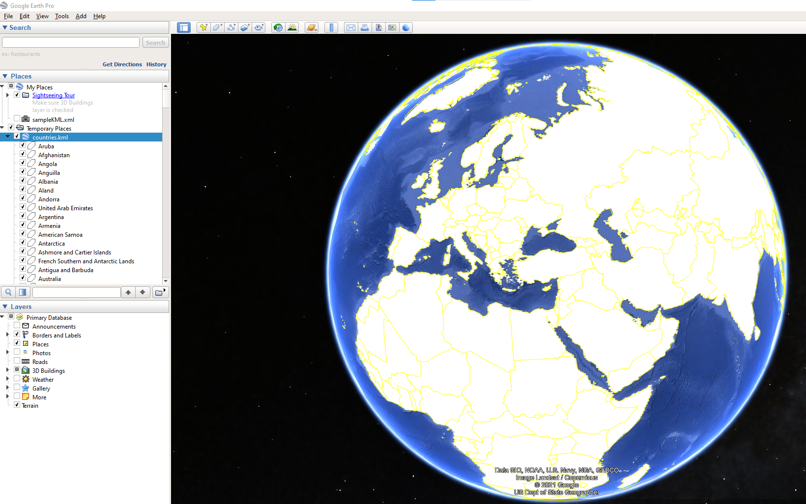

# SER - Labo 3 - JSON/KML

**Auteurs**: Mathieu Maillard, Yanick Thomann
**Date**: 28.05.2021


## Introduction

Le but de ce laboratoire est de créer un programme Java, permettant de convertir un fichier _geojson_ en _KML_. Le parsing du fichier geojson doit se faire avec les classe **json.simple** et l'écriture du fichier KML avec **JDOM2**. 


## Descriptif des classes

Nous utilisons dans ce programme 4 classes:

- **Polygon**: Cette classe permet de stocker les informations relatives à un polygone.

- **Country**: Cette classe permet de stocker toutes les informations relatives à un pays. Elle stocke notamment le nom, le nom ISO, le type de polygone utilisé pour représenter le pays, ainsi que les polygones qui le forment.

- **GeoJsonParser**: Cette classe contient les méthodes pour parser le fichier geojson. Nous appelons un constructeur par défaut pour initialiser le tableau de pays. Ensuite, la méthode `parse()` est utilisée pour lire le fichier XML, créer les pays avec leurs informations, et populer le tableau `countries` avec tous les pays crées.
- **KMLWriter**: Cette classe est utilisée pour écrire le fichier KML, en s'aidant du tableau de pays `countries` de la classe **GeoJsonParser**. On appelle le constructeur par défaut pour créer l'objet, puis la méthode `write()` est utilisée pour créer le fichier KML.


## Problèmes connus

Le programme dans son ensemble à l'air de fonctionner correctement. Aucun problème n'est connu de notre part.


## Résultats

Une partie du résultat du parsing du fichier _geojson_ est affiché ci-dessous:

```
(ABW) Aruba
	 - 26 coordinates
(AFG) Afghanistan
	 - 1533 coordinates
(AGO) Angola
	 - 14 coordinates
	 - 1492 coordinates
	 - 139 coordinates
(AIA) Anguilla
	 - 24 coordinates
	 - 4 coordinates

...

(ZAF) South Africa
	 - 26 coordinates
	 - 9 coordinates
	 - 1849 coordinates
	 - 324 coordinates
(ZMB) Zambia
	 - 1508 coordinates
(ZWE) Zimbabwe
	 - 766 coordinates
```

Ci-dessous, nous voyons le résultat obtenu lors de l'import du fichier KML dans Google Earth.



## Difficultés rencontrées


## Apprentissages


## Conclusion

